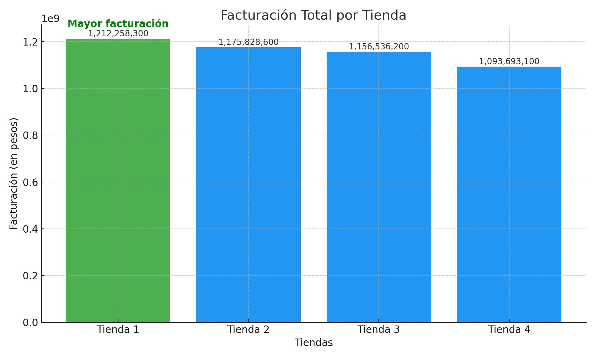
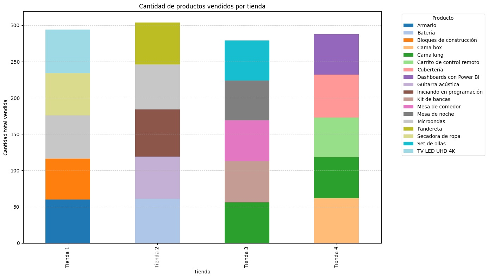
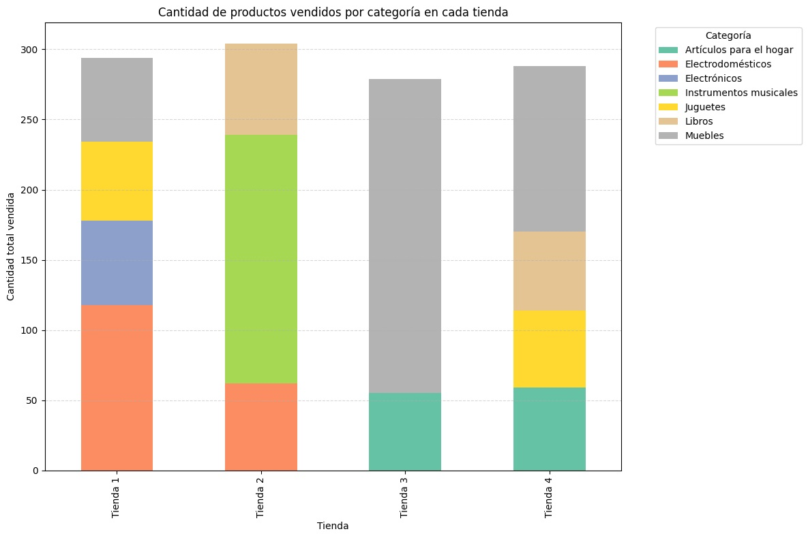
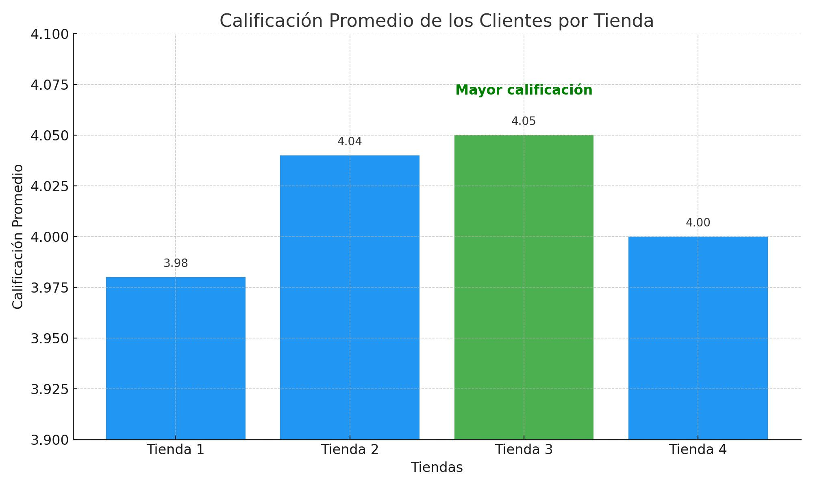
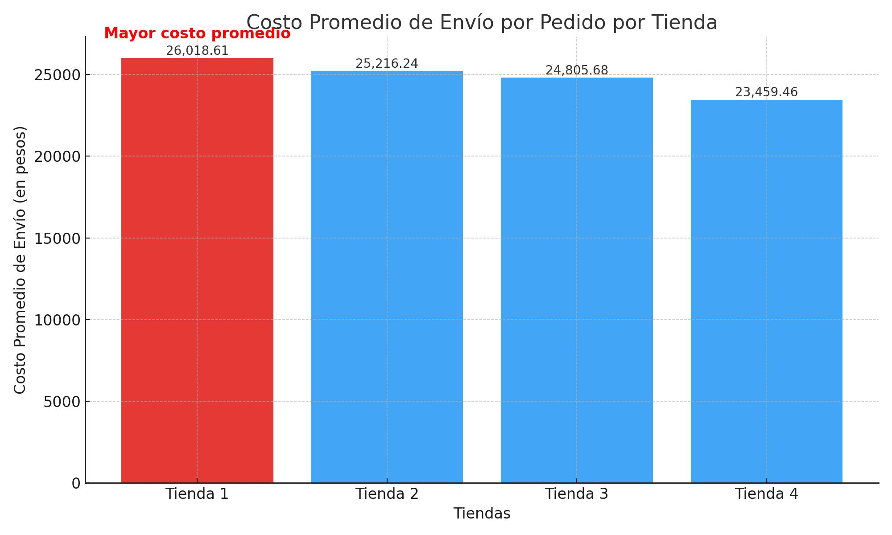

# DataScienceChallengeAluraStore

1. El propósito del análisis realizado.

Objetivo es ayudar al señor Juen en decidir que tienda vender para invertir en un nuevo negocio.

  Los puntos a trabajar son:

* Facturación total de cada tienda
* Categorías más populares
* Promedio de calificaciíon de los clientes
* Puntos más y menos vendidos
* Costo promedio de envío

Generar un informe final basandome en las 5 evaluaxciones anteriores para determinar cual tienda es la que debe vender el señor Juan.

Se subio el archivo AluraStoreLatam.ipynb que esl el código de extracción de datos.
Se selecciono la opción drive de la cuenta de correo que se genero de Google para hacer la copia de la información de Google Colab

2. La estructura del proyecto y organización de los archivos.

El conjunto de datos incluye la siguiente información:

- Producto y Categoría: Artículos vendidos y sus calificaciones.
- Precio y Envío: Valores de venta y costos asociados.
- Fecha y ubicación de compra: Información temporal y geográfica.
- Evaluación de compra: Comentarios de clientes.
- Tipo de Pago y Cuotas: Métodos utilizados por los clientes.
- Coordenadas Geográficas: Ubicación de las transacciones.

Se trabajo en las partes de:
+ Análisis de Facturación
+ Ventas por categoría
+ Calificación promedio de la tienda
+ Productos más y menos vendidos
+ Envío promedio por tienda

3. Ejemplos de gráficos e insights obtenidos.

4. Instrucciones para ejecutar el notebook.

