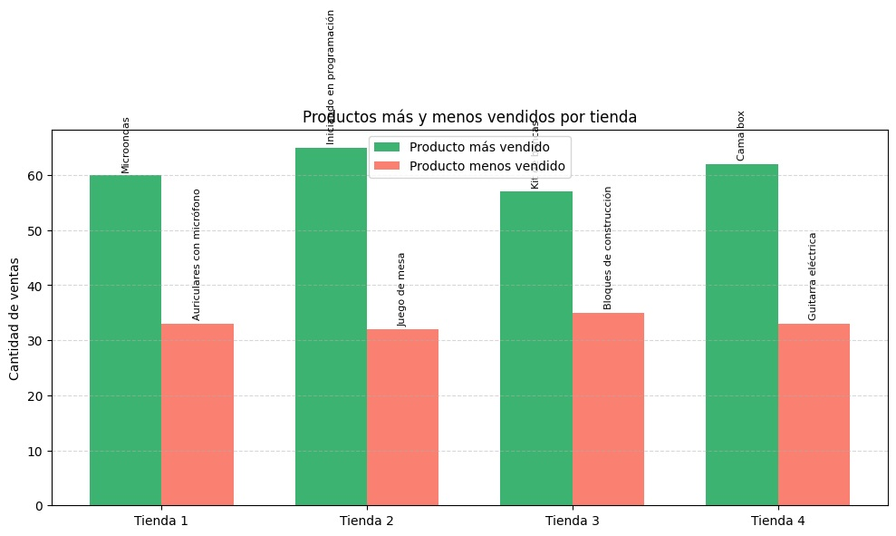

# DataScienceChallengeAluraStore

## 1. El propósito del análisis realizado.

El objetivo principal de este análisis es asistir al señor Juan en la toma de una decisión estratégica crucial: qué tienda de su propiedad debería vender para obtener capital e invertir en un nuevo negocio. Para lograr esto, se han evaluado exhaustivamente cinco aspectos clave del rendimiento de cada una de sus tiendas:

* **Facturación total de cada tienda:** Para comprender el volumen de ventas y el potencial de ingresos de cada ubicación.
* **Categorías más populares:** Para identificar qué tipos de productos generan mayor demanda en cada tienda.
* **Promedio de calificación de los clientes:** Para medir la satisfacción del cliente y la reputación de cada tienda.
* **Productos más y menos vendidos:** Para identificar los artículos de alto y bajo rendimiento en cada ubicación.
* **Costo promedio de envío:** Para evaluar la eficiencia operativa y los gastos asociados a la logística de cada tienda.

El resultado de este análisis se presenta en un informe final que proporciona una recomendación clara y justificada sobre cuál tienda sería la más adecuada para vender, considerando tanto su valor potencial de venta como su rendimiento operativo.

Se ha utilizado el archivo `AluraStoreLatam.ipynb` para llevar a cabo la extracción, limpieza y análisis de los datos necesarios para esta evaluación. Para facilitar el acceso a los datos en el entorno de Google Colab, se seleccionó la opción de Drive de la cuenta de correo generada por Google, asegurando así una copia local de la información para su procesamiento.

## 2. La estructura del proyecto y organización de los archivos.

El conjunto de datos analizado contiene información detallada sobre las transacciones de las tiendas, incluyendo los siguientes aspectos relevantes para el análisis:

* **Producto y Categoría:** Identificación de los artículos vendidos y la categoría a la que pertenecen.
* **Precio y Envío:** Valores de venta de los productos y los costos de envío asociados a cada transacción.
* **Fecha y ubicación de compra:** Registro temporal y geográfico de las ventas.
* **Evaluación de compra:** Comentarios y calificaciones proporcionadas por los clientes después de la compra.
* **Tipo de Pago y Cuotas:** Métodos de pago utilizados por los clientes y la información sobre pagos a plazos.
* **Coordenadas Geográficas:** Ubicación precisa de las transacciones mediante coordenadas.

El análisis se centró en las siguientes áreas específicas para cada tienda:

* **Análisis de Facturación:** Cálculo del total de ingresos generados por cada tienda.
* **Ventas por categoría:** Identificación de las categorías de productos con mayor volumen de ventas.
* **Calificación promedio de la tienda:** Determinación de la satisfacción general del cliente a través de las calificaciones promedio.
* **Productos más y menos vendidos:** Identificación de los productos con mayor y menor demanda en términos de unidades vendidas.
* **Envío promedio por tienda:** Cálculo del costo promedio de envío por pedido para cada ubicación.

## 3. Ejemplos de gráficos e insights obtenidos.

A continuación, se presentan algunos de los gráficos generados durante el análisis, que ilustran los insights clave obtenidos sobre el rendimiento de las tiendas:

*Insight:* Este gráfico compara la facturación total de cada una de las tiendas, permitiendo identificar la que genera mayores ingresos brutos.

*Insight:* Este gráfico muestra los productos individuales con mayor volumen de ventas en cada tienda, revelando las preferencias específicas de los clientes en cada ubicación.

*Insight:* Este gráfico destaca las categorías de productos que tienen mayor demanda en cada tienda, proporcionando información valiosa sobre el enfoque comercial de cada ubicación.

*Insight:* Este gráfico compara la calificación promedio otorgada por los clientes a cada tienda, ofreciendo una visión clara del nivel de satisfacción del cliente en cada ubicación.

*Insight:* Este gráfico identifica los productos con el mayor y menor número de ventas en cada tienda, lo que puede ayudar a optimizar el inventario y las estrategias de marketing.

*Insight:* Este gráfico compara el costo promedio de envío por pedido en cada tienda, lo que puede indicar diferencias en la eficiencia logística o en las estrategias de precios de envío.

## 4. Instrucciones para ejecutar el notebook.

Para replicar el análisis y visualizar los resultados detallados, siga las siguientes instrucciones para ejecutar el notebook `AluraStoreLatam.ipynb`:

1.  **Acceder a Google Colab:** Abra su navegador web y diríjase a [https://colab.research.google.com/](https://colab.research.google.com/).
2.  **Subir el notebook:** Haga clic en "Archivo" en la barra de menú superior y seleccione "Subir notebook". Busque y seleccione el archivo `AluraStoreLatam.ipynb` desde su equipo.
3.  **Conectar a Google Drive:** El notebook contiene código para acceder a los datos almacenados en Google Drive. Asegúrese de haber copiado los datos relevantes en su cuenta de Google Drive. Cuando el notebook le solicite autorización para acceder a su Drive, otórguela.
4.  **Ejecutar las celdas de código:** Ejecute las celdas de código en secuencia, haciendo clic en el icono de "play" (▶) que aparece al pasar el cursor sobre cada celda, o utilizando los atajos de teclado (Shift + Enter para ejecutar la celda actual y pasar a la siguiente, Ctrl + Enter para ejecutar la celda actual).
5.  **Visualizar los resultados:** A medida que se ejecutan las celdas, se mostrarán los resultados del análisis, incluyendo tablas y gráficos. Revise las salidas para comprender la facturación, las categorías más populares, las calificaciones de los clientes, los productos más y menos vendidos y los costos de envío promedio para cada tienda.
6.  **Analizar el informe final:** Al final del notebook, encontrará un informe conciso que resume los hallazgos clave y proporciona una recomendación sobre qué tienda debería vender el señor Juan, basándose en el análisis de los cinco aspectos evaluados.
